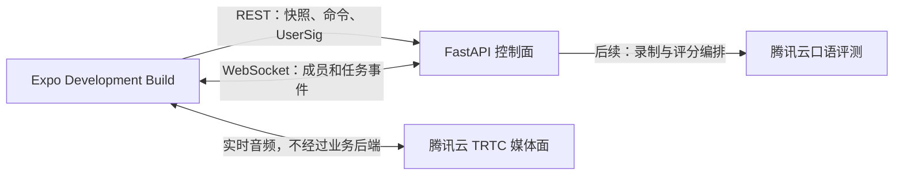
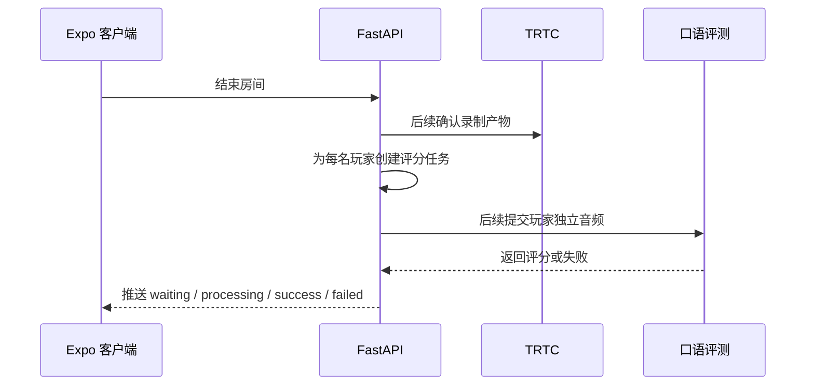

# 基础框架架构设计

> 本文记录分仓前已经完成的基础框架。目标仓库边界已调整为公开 App、私有 FastAPI 后端和私有运营平台，最新决策以 [V1 前后端架构](./v1-product-architecture.md) 为准。

## 设计目标

基础框架首先证明两个能力：

1. React Native Expo 客户端可以通过 Development Build 运行并打开 Demo 页面。
2. Python FastAPI 后端可以启动，并为健康检查、后续鉴权、多人房间和评分任务提供清晰边界。

当前阶段不接入真实腾讯云服务，不保存任何真实密钥。

## 系统结构



业务后端属于控制面，只处理身份、房间生命周期、状态同步和任务编排。TRTC 属于媒体面，直接承载客户端之间的实时音频。

## 初始仓库结构

```text
english-room/
├── apps/
│   ├── mobile/                   # React Native Expo 客户端
│   └── api/                      # Python FastAPI 后端
├── docs/
│   ├── architecture/             # 架构与数据流
│   ├── discussions/              # 讨论过程
│   ├── plans/                    # 实施计划
│   ├── requirements/             # 需求解读
│   └── source/                   # 原始题目副本
├── .env.example                  # 仅记录变量名和安全示例
└── README.md
```

该结构用于先验证 Expo 与 FastAPI 可以独立启动，不再作为最终交付结构。后端会迁移到 `english-room-backend` 私有仓库；本仓库只保留 App、公开契约、Fake 适配器和交付文档。

## 客户端边界

客户端使用 React Native Expo、TypeScript 和 Expo Router。

### 页面

- Demo 首页：展示客户端和 API 状态。
- 后续房间页：展示房间成员、麦克风状态和评分状态。

### 服务接口

- `ApiClient`：调用 FastAPI。
- `RealtimeClient`：后续封装 WebSocket。
- `RtcClient`：后续封装 `trtc-react-native`。

`RtcClient` 必须具有 Fake 实现，使界面、状态机和自动化测试不依赖真实腾讯云账号。接入原生 TRTC 时使用 Expo Development Build 和 CNG，不依赖 Expo Go。

## 后端边界

FastAPI 后端采用按业务能力划分的模块：

- `health`：健康检查。
- `config`：环境配置及敏感变量校验。
- `auth`：后续签发短期客户端身份和 TRTC `UserSig`。
- `rooms`：后续管理房间生命周期、成员和版本。
- `scoring`：后续管理玩家评分任务和状态。

应用创建逻辑集中在 `create_app()`，便于测试中构造独立实例。

## 多人房间状态策略

业务房间状态以 FastAPI 后端为真相源，TRTC 事件只代表媒体状态。

后续房间模型至少包含：

- `room_id`
- `status`
- `version`
- `members`
- `created_at`
- `ended_at`

每次成员或房间状态变化都递增 `version`。客户端重连后先获取完整快照，再继续处理大于当前版本的增量事件。

Demo 阶段使用单实例内存 `RoomStore`，但业务服务只依赖抽象接口。正式部署可替换为 Redis，并增加 Socket.IO 或 WebSocket 的跨实例广播层。

## 局后评分数据流



每个评分任务使用稳定的 `player_id`、`room_id` 和 `audio_asset_id` 建立关联，避免多人音频和结果错配。

## 安全约束

- 腾讯云 `SecretKey` 只存在于 FastAPI 运行环境。
- 客户端只能获取后端签发的短期凭证。
- 公开仓库只提交 `.env.example`。
- 日志不得输出密钥、完整 `UserSig` 或访问令牌。
- 推送前执行敏感信息扫描。

## 错误处理

- API 使用一致的 HTTP 错误结构。
- 客户端区分 API 离线、媒体连接失败和评分失败。
- Demo 页面在 API 不可用时显示可理解的离线状态，不发生白屏。
- 后续房间命令使用请求 ID 支持幂等处理。

## 测试策略

### FastAPI

- 使用 `pytest` 和 FastAPI `TestClient`。
- 先测试 `/health` 的行为，再实现端点。
- 后续房间服务使用内存 Store 做真实状态测试，不依赖外部数据库。
- 使用 Ruff 做格式与静态检查，使用 mypy 做类型检查。

### Expo

- 使用 Jest 和 React Native Testing Library。
- 先测试 Demo 页面应展示的状态，再实现组件。
- `ApiClient` 使用依赖注入，使测试不访问真实网络。
- 使用 `tsc --noEmit` 执行 TypeScript 类型检查。

### 运行验收

- 启动 FastAPI 并请求 `/health`。
- 启动 Expo Development Build 或可验证的 Expo 运行环境。
- 在设备或模拟器上打开 Demo 页面，确认页面内容和 API 状态可见。

## 技术取舍

选择 FastAPI 的原因：

- Python 与口语评分、音频处理和异步任务生态衔接自然。
- Pydantic 模型可以直接生成 OpenAPI，便于客户端后续生成类型。
- 应用工厂和依赖注入适合对房间服务进行隔离测试。
- 相比在本项目中引入 Next.js，FastAPI 的后端职责更单一，也不会与移动端 UI 框架混淆。

当前不引入 Redis、数据库和任务队列，是为了在 3 天 Demo 周期内先验证最高风险的客户端原生运行和多人实时语音链路。生产方案仍需要补充这些基础设施。
