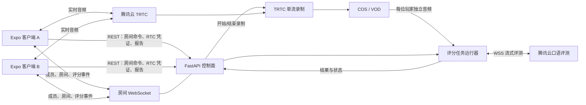
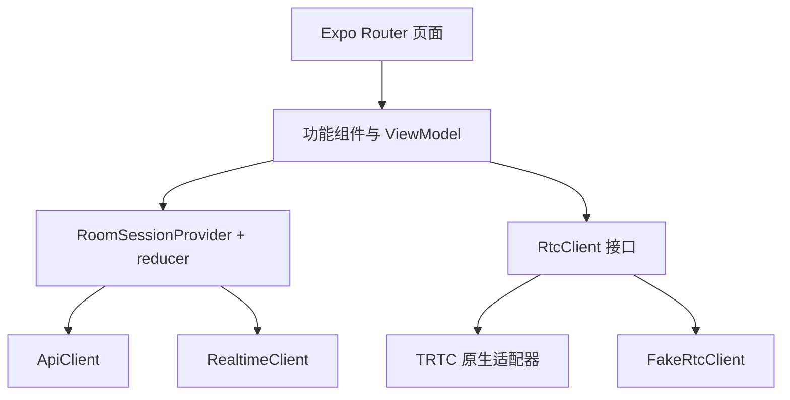
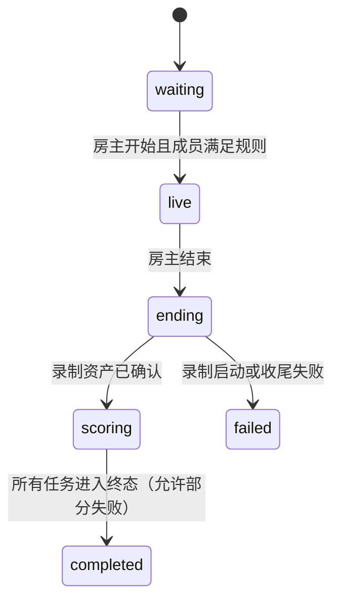
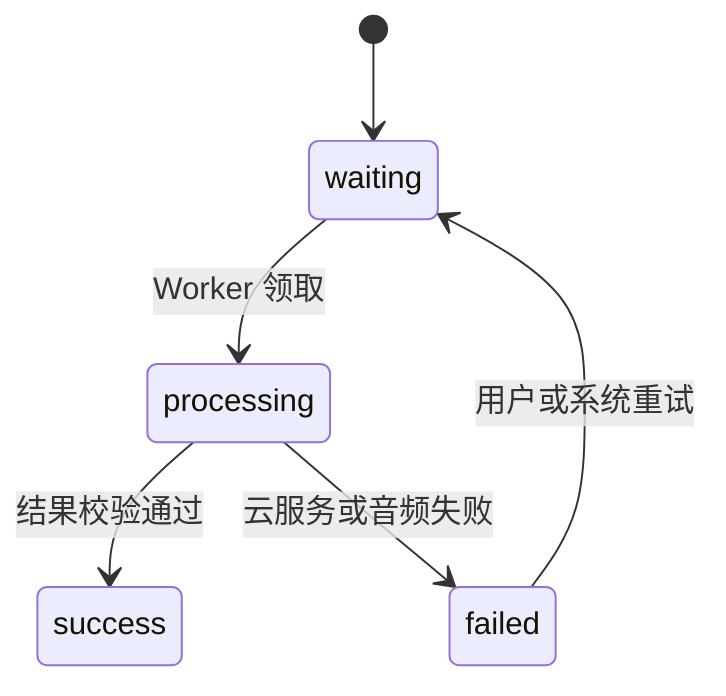
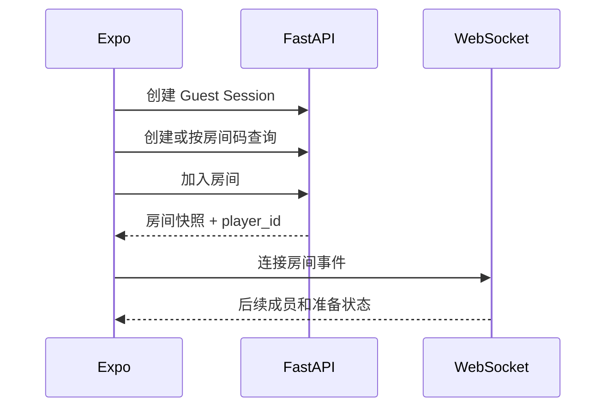
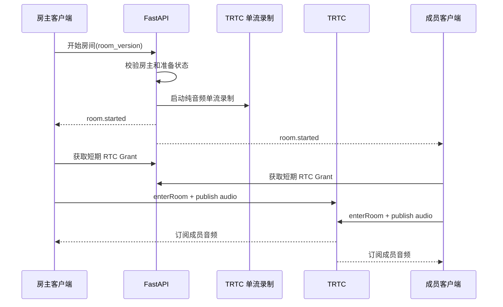
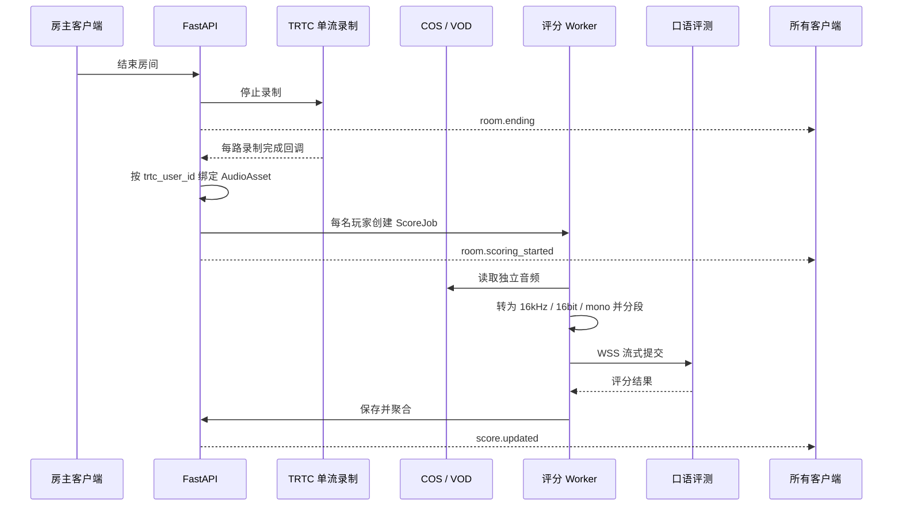
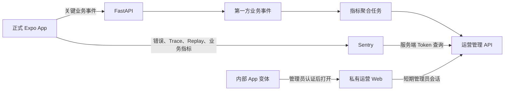

# V1 前后端架构设计

日期：2026-07-25

状态：三仓与运营方向已确认，待迁移实施

## 1. 设计目标

本架构服务于原始实作题和已确认的四个页面：

1. 大厅与加入房间。
2. 房间等待与玩家准备。
3. 多人实时语音房间。
4. 局后英语评分报告。

V1 需要在短周期内形成可录屏的完整闭环，同时保留替换内存状态、进程内任务和 Fake 云服务的边界。

## 2. 核心决策

| 主题 | 决策 | 理由 |
| --- | --- | --- |
| 客户端 | Expo Development Build + Expo Router | 支持 React Native 快速开发和 TRTC 原生模块 |
| 业务后端 | FastAPI 模块化单体 | 便于快速交付、测试和后续音频处理 |
| 房间状态 | FastAPI 是业务状态真相源 | 避免将 TRTC 媒体事件误当作完整业务状态 |
| 实时媒体 | 客户端直连 TRTC | 业务后端不承担音频转发成本和延迟 |
| 房间事件 | REST 快照 + WebSocket 增量事件 | 支持重连、版本校验和多人状态同步 |
| 玩家音频 | TRTC 纯音频单流录制 | 每位玩家生成独立音频，避免评分错配 |
| 评分执行 | FastAPI 异步任务调用口语评测 | 密钥不下发客户端，集中处理重试和聚合 |
| Demo 存储 | 内存 Repository + 本地任务运行器 | 缩短开发时间，但接口允许替换 |
| 仓库边界 | 公开 App + 私有 API + 私有运营平台 | 最终只交付 App，保护后端实现和管理能力 |
| 正式包观测 | Sentry + 第一方业务事件 | 同时关联业务表现与真实用户故障 |
| 运营入口 | 独立内部 App 变体 | 使用编译期和分发渠道隔离，不依赖隐藏入口 |

### 2.1 仓库与交付边界

```text
maowulin/english-room          Public
  React Native Expo App
  公开 API 合约和生成客户端
  FakeApiClient / FakeRtcClient
  页面设计、交付文档和运行说明

maowulin/english-room-backend  Private
  FastAPI 业务控制面
  房间、RTC、录制和评分编排
  第一方业务事件与指标聚合
  运营管理 API 和 Sentry 服务端代理

maowulin/english-room-op       Private
  React Web 运营管理站
  内部 App 变体入口和构建配置
  DAU、增长、留存和转化看板
  错误、Replay 和受控调试工具
```

只有 `english-room` 是候选人交付物。它必须在没有私有仓库权限时仍能使用 Fake 适配器运行完整页面闭环；连接真实服务时只依赖公开 API 合约和环境配置。

仓库之间不增加第四个共享代码仓。FastAPI 的 OpenAPI 是接口真相源：

1. 后端生成经过审查的 `openapi.json`。
2. App 和运营平台各自生成并提交类型安全客户端。
3. API 不兼容变更通过版本路径和生成客户端差异显式暴露。

### 2.2 正式包与内部运营包

| 变体 | 分发 | 包含内容 | 明确排除 |
| --- | --- | --- | --- |
| `production` | App Store / Play Store | 产品页面、Sentry、业务事件上报 | 运营入口、管理 UI、管理 Token |
| `internal-ops` | Ad Hoc、TestFlight 内测或企业分发 | 产品页面、管理员登录、运营平台入口 | 长期有效凭证 |

两个变体使用不同的 Bundle Identifier/Application ID。私有运营仓库检出指定版本的公开 App，在构建期叠加内部入口和配置；因此公开 App 仓库和正式生产 Bundle 都不包含运营实现。

内部入口不能作为安全边界。即使拿到内部包，用户仍必须经过管理员认证和服务端 RBAC 校验。

## 3. 系统边界



控制面和媒体面必须分离：

- FastAPI 管理玩家身份、房间生命周期、席位、准备状态、评分任务和最终报告。
- TRTC 管理入房、推流、订阅、实时音量和网络质量。
- TRTC 的远端用户上线事件只更新媒体状态，不能直接创建或删除业务玩家。

## 4. 页面与能力映射

| 路由 | 设计图 | 读取数据 | 用户命令 | 必须展示的异常 |
| --- | --- | --- | --- | --- |
| `/` | `01-room-entry.png` | 推荐剧本、最近房间、当前玩家 | 创建房间、按房间码加入 | 房间不存在、房间已满 |
| `/rooms/[roomId]/lobby` | `02-waiting-room.png` | 房间快照、席位、准备状态 | 麦克风检查、准备、开始房间 | 麦克风拒绝、成员连接中 |
| `/rooms/[roomId]/live` | `03-live-voice-room.png` | 房间进度、媒体状态、当前线索 | 静音、扬声器、结束房间 | 玩家重连、弱网、服务端断线 |
| `/rooms/[roomId]/report` | `04-score-report.png` | 每位玩家的任务和结果 | 重试失败任务、查看详情 | 等待、处理中、成功、失败 |

导航不依赖客户端猜测。客户端读取房间快照后，根据服务端状态决定目标页面：

```text
waiting -> lobby
live -> live
ending | scoring | completed | failed -> report
```

## 5. 客户端架构

### 5.1 分层



页面只负责布局、导航和用户交互，不能直接调用 TRTC SDK 或解析 WebSocket 消息。

### 5.2 推荐目录

```text
apps/mobile/src/
├── app/
│   ├── index.tsx
│   └── rooms/[roomId]/
│       ├── lobby.tsx
│       ├── live.tsx
│       └── report.tsx
├── features/
│   ├── entry/
│   ├── lobby/
│   ├── live-room/
│   └── score-report/
├── room-session/
│   ├── room-session-provider.tsx
│   ├── room-session-reducer.ts
│   ├── room-session-selectors.ts
│   └── room-session-types.ts
├── services/
│   ├── api-client.ts
│   ├── realtime-client.ts
│   └── rtc/
│       ├── rtc-client.ts
│       ├── trtc-rtc-client.ts
│       └── fake-rtc-client.ts
└── theme/
```

### 5.3 客户端状态分类

| 状态 | 真相源 | 示例 |
| --- | --- | --- |
| 业务状态 | FastAPI | 房主、席位、准备状态、房间阶段、评分状态 |
| 媒体状态 | TRTC SDK | 正在说话、静音、网络质量、远端音频可用 |
| 本地 UI 状态 | 客户端 | 按钮加载、弹窗、麦克风检查进度 |

`RoomSessionProvider` 维护服务端快照和版本化事件。音量值等高频媒体数据保留在 `RtcClient` 或局部组件内，不写入全局业务状态。

### 5.4 客户端事件处理

```text
打开房间页面
  -> GET 房间快照
  -> 保存 snapshot.version
  -> 建立 WebSocket
  -> 只接受 version > currentVersion 的事件
  -> 发现版本跳跃时重新获取快照
```

客户端断线重连后必须先恢复业务快照，再恢复 TRTC 入房。这样可以避免先看到远端音频用户，却没有对应业务玩家资料。

### 5.5 RtcClient 接口

```ts
type RtcClient = {
  enterRoom(grant: RtcGrant): Promise<void>;
  leaveRoom(): Promise<void>;
  setMicrophoneMuted(muted: boolean): Promise<void>;
  subscribe(listener: (event: RtcEvent) => void): () => void;
};
```

`FakeRtcClient` 提供确定性的玩家发言、静音、弱网和重连事件，用于页面开发、Jest 和录屏兜底。真实适配器只负责把 TRTC 原生事件转换成统一的 `RtcEvent`。

## 6. 后端架构

### 6.1 模块化单体

```text
apps/api/src/english_room_api/
├── app.py
├── config.py
├── auth/
│   ├── router.py
│   ├── schemas.py
│   └── service.py
├── rooms/
│   ├── router.py
│   ├── schemas.py
│   ├── models.py
│   ├── repository.py
│   └── service.py
├── realtime/
│   ├── router.py
│   └── broadcaster.py
├── rtc/
│   ├── credentials.py
│   ├── recording.py
│   └── tencent.py
└── scoring/
    ├── router.py
    ├── schemas.py
    ├── models.py
    ├── repository.py
    ├── runner.py
    ├── service.py
    └── tencent_soe.py
```

每个业务模块包含自己的输入模型、领域行为和 Repository 接口。腾讯云 SDK 只能出现在 `rtc` 和 `scoring` 适配器中，不能进入路由或领域模型。

### 6.2 运行时组件

| 组件 | Demo 实现 | 正式产品替换 |
| --- | --- | --- |
| RoomRepository | 进程内内存 | PostgreSQL |
| Presence / 广播 | 单进程 WebSocket | Redis Presence + Pub/Sub |
| ScoreJobRepository | 进程内内存 | PostgreSQL |
| JobRunner | `asyncio` 进程内任务 | 独立 Worker + Redis 队列 |
| AudioAssetStore | 云端 URL 元数据 | PostgreSQL + COS 生命周期策略 |

路由只完成鉴权、参数解析和响应转换。房间规则、幂等性和状态迁移由 Service 承担。

## 7. 领域模型

### 7.1 核心实体

```text
Player
  player_id
  display_name
  avatar_key

Room
  room_id
  room_code
  trtc_room_id
  story_id
  host_player_id
  status
  version
  created_at
  started_at
  ended_at

RoomMember
  room_id
  player_id
  trtc_user_id
  seat_index
  ready_state
  connection_state

AudioAsset
  audio_asset_id
  room_id
  player_id
  trtc_user_id
  storage_uri
  duration_ms
  format
  status

RecordingSession
  recording_id
  room_id
  provider_task_id
  status
  started_at
  stopped_at

ScoreJob
  score_job_id
  room_id
  player_id
  audio_asset_id
  status
  attempt
  error_code

ScoreResult
  overall
  pronunciation
  fluency
  task_completion
  vocabulary
  speaking_seconds
  utterance_count
```

`player_id`、`trtc_user_id`、`audio_asset_id` 和 `score_job_id` 必须显式存储，不能依赖文件名或数组下标推断玩家。

### 7.2 房间状态机



房间的 `completed` 表示所有玩家任务都进入终态，不表示所有评分都成功。单个玩家的评分状态独立维护。

### 7.3 评分状态机



同一 `room_id + player_id + audio_asset_id` 只允许一个有效任务。重试递增 `attempt`，不创建无法追踪的新玩家结果。

## 8. API 与实时事件

### 8.1 REST API

| 方法 | 路径 | 作用 |
| --- | --- | --- |
| `POST` | `/v1/guest-sessions` | 创建 Demo 玩家身份和短期访问令牌 |
| `POST` | `/v1/rooms` | 创建房间 |
| `GET` | `/v1/rooms/by-code/{roomCode}` | 查询可加入房间 |
| `POST` | `/v1/rooms/{roomId}/members` | 加入房间并分配席位 |
| `GET` | `/v1/rooms/{roomId}` | 获取完整房间快照 |
| `PUT` | `/v1/rooms/{roomId}/members/me/ready` | 更新准备状态 |
| `POST` | `/v1/rooms/{roomId}/start` | 房主开始房间 |
| `POST` | `/v1/rooms/{roomId}/rtc-grants` | 获取短期 TRTC 入房凭证 |
| `POST` | `/v1/rooms/{roomId}/end` | 房主结束并触发录制收尾 |
| `GET` | `/v1/rooms/{roomId}/report` | 获取所有玩家评分状态和结果 |
| `POST` | `/v1/score-jobs/{jobId}/retry` | 重试失败任务 |

写操作携带 `Idempotency-Key`。房主命令还需要提交客户端看到的 `room_version`，版本不匹配时返回 `409` 并要求客户端刷新快照。

### 8.2 WebSocket

```text
GET /v1/rooms/{roomId}/events
Authorization: Bearer <access-token>
```

事件信封：

```json
{
  "event_id": "evt_01",
  "room_id": "room_01",
  "version": 12,
  "type": "member.ready_changed",
  "occurred_at": "2026-07-25T12:00:00Z",
  "payload": {}
}
```

V1 事件类型：

- `member.joined`
- `member.left`
- `member.ready_changed`
- `room.started`
- `room.ending`
- `room.scoring_started`
- `score.updated`
- `room.completed`
- `room.failed`

## 9. 关键数据流

### 9.1 创建或加入房间



### 9.2 开始实时语音



UserSig 必须由 FastAPI 签发。腾讯云明确建议正式环境将 UserSig 计算放在服务端，客户端不能包含 `SDKSecretKey`。

### 9.3 结束房间与评分



## 10. 独立音频与评分策略

### 10.1 推荐方案

使用 TRTC 纯音频单流录制：

- 单流录制会按用户分别生成媒体文件。
- 后端使用录制白名单订阅房间成员的 `trtc_user_id`。
- 录制回调携带的用户标识必须映射到既有 `RoomMember`。
- 混流录制只能用于回放，不能作为逐玩家评分输入。

腾讯云官方资料：

- [开始云端录制](https://cloud.tencent.com/document/product/647/73786)
- [云端录制与回放](https://cloud.tencent.com/document/product/647/76497)

### 10.2 音频规范

口语评测输入统一转换为：

- 16kHz
- 16bit
- 单声道
- PCM、WAV 或服务支持的压缩格式

自由说模式单次最长支持 300 秒，因此不能把 25 分钟整段音频作为一次请求提交。

V1 策略：

- Demo 房间控制在 2—5 分钟。
- 每名玩家选择一个不超过 300 秒的有效发言片段。
- 评分任务异步执行，报告页实时显示状态变化。

正式产品策略：

- 游戏过程中按语音活动和剧情回合切出短片段。
- 逐段评测并在局后完成加权聚合。
- 原始录音、片段和评测结果都保留稳定 ID 关联。

官方资料：

- [智聆口语评测接口](https://cloud.tencent.com/document/product/1774/107497)
- [自由说评测模式](https://cloud.tencent.com/document/product/1774/107389)
- [音频与时长限制](https://cloud.tencent.com/document/product/1774/107339)

### 10.3 报告字段来源

设计图中的维度不能全部标记为腾讯云原生分数：

| UI 字段 | 数据来源 |
| --- | --- |
| 总分 | 可解释的加权聚合 |
| 发音 | `PronAccuracy` |
| 流利度 | `PronFluency` 标准化为百分制 |
| 任务完成度 | 已完成剧情提示、目标关键词或情景评测结果 |
| 词汇表现 | 识别文本中的词汇多样性和目标词覆盖率 |
| 发言次数 | 客户端或服务端语音活动片段统计 |
| 英语时长 | 玩家独立音频中的有效语音时长 |

自由说模式主要返回精准度和流利度，因此正式页面建议把设计图中的“完整度”命名为“任务完成度”，避免误导。

## 11. 安全设计

- 腾讯云 `SecretKey`、SOE 签名密钥和录制存储凭证只存在于 FastAPI 或 Worker 环境。
- UserSig 使用短有效期，并与唯一 `trtc_user_id` 绑定。
- 客户端日志不得输出完整 UserSig、访问令牌或录制 URL 签名。
- WebSocket 使用与 REST 相同的玩家访问令牌。
- 房主开始、结束和重试评分都在服务端校验权限。
- 录制回调必须校验签名和幂等处理。
- 音频对象默认私有，报告只返回短期访问地址或不返回原始音频。

## 12. 错误与恢复

| 场景 | 客户端表现 | 后端处理 |
| --- | --- | --- |
| API 暂时离线 | 保留最后快照并显示重连 | 无状态变更 |
| WebSocket 断线 | 显示连接中，退避重连 | 重连后允许重新拉取快照 |
| TRTC 弱网 | 玩家席位显示弱网 | 仅更新本地媒体状态 |
| 玩家离开后回来 | 席位显示重连中 | 保留成员身份和席位宽限期 |
| 录制文件延迟 | 报告页显示等待评分 | 等待回调，不重复创建任务 |
| SOE 调用失败 | 对应玩家显示评分失败 | 保存错误码并允许幂等重试 |
| 部分玩家评分失败 | 成功玩家结果可查看 | 房间仍可进入 completed |

## 13. 测试架构

### 客户端

- reducer 测试事件版本、乱序、重复事件和快照恢复。
- 页面测试四种评分状态和玩家映射。
- `FakeRtcClient` 测试发言、静音、弱网和重连。
- Maestro 覆盖加入、等待、实时房间和报告主路径。

### 后端

- Service 单元测试房间状态机和权限规则。
- Repository 合约测试保证内存与正式实现行为一致。
- API 测试状态码、幂等键和版本冲突。
- WebSocket 测试事件顺序和重连后的快照恢复。
- Fake 腾讯云适配器测试录制回调、玩家音频映射和评分重试。

### 真实云服务验收

- 两台设备使用不同 `player_id` 和 `trtc_user_id` 入房。
- 双方能互相听到语音并看到正确发言状态。
- 结束后得到两份独立音频。
- 每份音频只生成对应玩家的评分任务。
- 至少演示一次处理中和一次失败重试。

## 14. V1 实施顺序

1. 房间领域模型、内存 Repository 和 REST 快照。
2. 大厅与等待房页面，完成双设备成员同步。
3. `RtcClient` Fake 和真实 TRTC 适配器。
4. 实时语音页，验证双设备音频、静音和重连。
5. 录制适配器和每玩家 `AudioAsset` 映射。
6. 评分状态机、Fake SOE 和报告页。
7. 真实 SOE 接入、失败重试和录屏脚本。

该顺序先验证最高风险的多人实时语音和独立音频，再投入评分展示细节。

## 15. 明确不做

V1 不引入以下能力：

- 微服务拆分。
- 多实例部署。
- 完整注册登录和购买流程。
- 通用聊天系统。
- 视频通话。
- 实时逐字字幕。
- 自定义推荐算法。
- 复杂排行榜。

这些能力不会提升本次试题核心闭环的可信度。

## 16. 架构验收标准

架构进入实现计划前必须确认：

- 四个页面都能映射到明确的后端数据和用户命令。
- 业务房间状态与 TRTC 媒体状态没有混用。
- 每位玩家、TRTC 用户、独立音频和评分任务存在稳定关联。
- 评分指标能说明哪些来自腾讯云，哪些由业务计算。
- Demo 组件都有 Fake 实现，真实云服务不可用时仍可开发和测试。
- 从 Demo 内存实现升级到数据库、Redis 和任务队列时不需要重写页面。
- App、后端和运营平台分别位于 Public、Private、Private 仓库。
- 正式 App Bundle 不包含运营路由、管理页面或管理凭证。
- 只获取公开 App 仓库的评审者可以运行 Fake 完整闭环。

## 17. 长线运营架构

### 17.1 数据流



App 中的 `AnalyticsClient` 定义统一事件协议，并将数据发送到两个 Sink：

- `SentryAnalyticsSink`：错误、性能、Replay、功能采用率和近实时转化。
- `FirstPartyAnalyticsSink`：影响 DAU、留存、漏斗和核心业务判断的稳定事件。

双路采集不是两套事件命名。事件名称、属性、隐私等级和版本只在一份事件目录中定义。

### 17.2 V1 事件目录

| 事件 | 触发时机 | 主要指标 |
| --- | --- | --- |
| `app_active` | App 进入前台并建立有效会话 | DAU、DAU 增长率 |
| `sign_in_completed` | 玩家登录成功 | 登录转化率 |
| `room_created` | 房间创建成功 | 创建采用率 |
| `room_joined` | 成员成为业务房间成员 | 入房转化率 |
| `rtc_join_succeeded` | TRTC 成功入房 | 媒体链路成功率 |
| `room_started` | 房间进入 `live` | 开局转化率 |
| `room_completed` | 房间进入终态 | 完赛率 |
| `score_viewed` | 玩家看到自己的评分 | 评分查看率 |

所有事件都携带 `event_id`、伪匿名 `user_id`、`occurred_at`、`app_version`、`platform` 和 `environment`。房间事件可携带 `room_id`，但不得把音频、转写文本、邮箱、手机号或完整访问令牌发送到 Sentry。

### 17.3 指标口径

```text
DAU = 当日触发 app_active 的唯一 user_id 数
DAU 增长率 = (当日 DAU - 前日 DAU) / 前日 DAU
入房转化率 = 唯一 room_joined 用户 / 唯一 app_active 用户
完赛率 = 唯一 room_completed 用户 / 唯一 room_joined 用户
评分查看率 = 唯一 score_viewed 用户 / 唯一 room_completed 用户
D1 留存 = 首次活跃后第 1 日再次活跃用户 / 对应新增用户
```

Sentry Application Metrics 和 Explore 用于 DAU、增长、功能采用率、近实时转化以及与错误、Trace、Replay 的关联。跨 Session 的 D1、D7、D30 留存和长期行为 Cohort 由 FastAPI 的第一方事件表计算。

### 17.4 运营平台边界

运营 Web 只调用 FastAPI 的 `/admin/v1/*` API，不直接持有 Sentry 管理 Token。FastAPI 使用服务端凭证查询 Sentry，并把最小必要的错误摘要、受影响用户数和 Replay 跳转信息返回运营平台。

管理员访问流程：

1. 内部 App 打开管理员登录。
2. FastAPI 完成账号、MFA 和设备策略校验。
3. 服务端签发短有效期、单用途的运营会话交换码。
4. 运营 Web 用交换码换取 `HttpOnly` 会话 Cookie。
5. 所有管理操作再次执行 RBAC、审计日志和幂等校验。

V1 运营能力包括：

- DAU、DAU 增长率、D1/D7 留存和核心转化漏斗。
- 按 App 版本、平台和环境筛选。
- 查看 Sentry Issue、受影响用户、版本分布和 Replay 跳转。
- 查看房间、录制、评分任务状态并重试允许重试的失败任务。
- 查看所有管理员操作审计记录。

运营平台不提供任意 SQL、任意后端命令或直接修改用户数据的能力。

### 17.5 隐私与成本

- Sentry Replay 默认遮罩文本、图片和向量内容，仅对错误会话提高采样率。
- 用户身份使用稳定伪匿名 ID；PII 只保存在明确授权的业务系统。
- 关键业务事件先写入 FastAPI，客户端离线时按数量和时长上限缓冲。
- Sentry 指标和 Replay 采样率按环境分别配置，避免 Demo 配置直接进入生产。
- 生产、预发布和内部运营数据使用不同 `environment`，管理看板默认只读生产环境。

### 17.6 设计依据

- [Expo：安装多个 App 变体](https://docs.expo.dev/build-reference/variants/)
- [Expo：创建内部分发构建](https://docs.expo.dev/tutorial/eas/internal-distribution-builds/)
- [Sentry：Application Metrics](https://sentry.io/product/metrics/)
- [Sentry：业务分析能力与跨 Session 分析边界](https://blog.sentry.io/product-analytics-you-already-have/)
